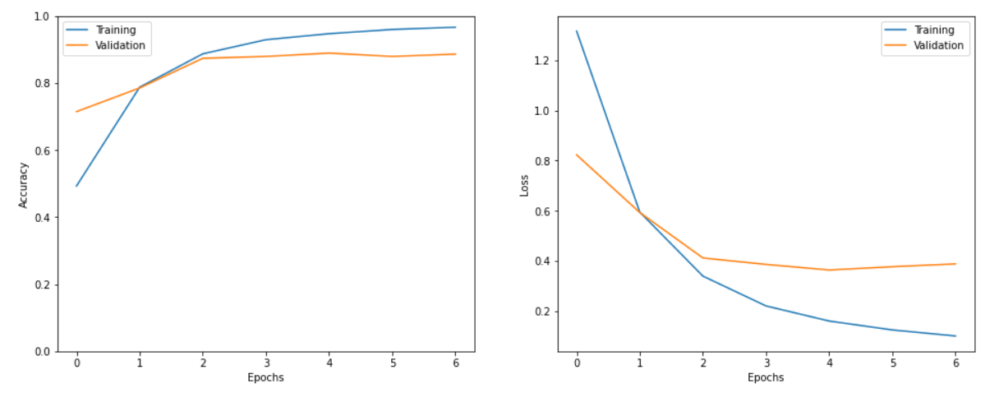

# Tweet-Emotion-Recognition

# Tweet :

A tweet is a post on Twitter. The act of writing a tweet is called tweeting or twittering. Tweets can be up to 140 characters long, including spaces, and can include URLs and hashtags. The 140-character limit comes from the 160-character limit required by the short message service (SMS).

## How to open

open Tweet Emotion Recognition - Learner.ipynb file

## Accuracy of the Model

